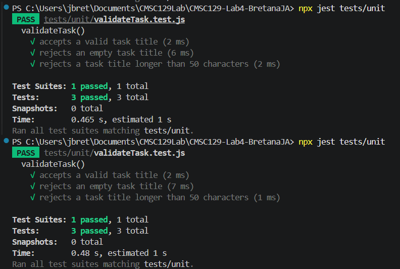

# Task Manager App
A very simple task manager app.

## User Stories
- As a user, I want to create a task so that I can keep track of things I need to do.

- As a user, I want to mark a task as completed so that I can see which tasks are finished.

- As a user, I want to delete a task so that I can remove tasks I no longer need.

## Tech Stack
Frontend: React + Vite

Backend: Express

Unit tests: Jest

Integration tests: Jest + Supertest

System tests: Playwright

## Testing Strategy

This project follows the Test-Driven Development (TDD) approach using the Red → Green → Refactor cycle at three testing levels: unit, integration, and system testing. Each level focuses on a different responsibility of the application to ensure both correctness and reliability.

### Unit Testing

Unit tests focus on isolated business logic without involving HTTP requests, the browser, or the backend server. The unit tests will target the task title validation logic to ensure task input behaves correctly before tasks are created.

The following behaviors will be tested:

- Valid task titles are accepted
- Empty task titles are rejected
- Task titles longer than 50 characters are rejected

These tests ensure the validation logic works independently and catches incorrect input early.

Tools used: Jest

### Integration Testing

Integration tests verify that the backend API routes, request handling, and task data storage work together correctly through real HTTP requests. These tests ensure that the Express routes correctly interact with the task management logic and return the proper responses.

The following behaviors will be tested:

- ``` POST /tasks ``` successfully creates a task and returns the correct response
- ``` DELETE /tasks/:id ``` successfully removes an existing task

These tests confirm that the backend components function correctly as a connected system.

**Tools used**: Jest + Supertest

### System Testing

System tests simulate real user interactions in a browser using Playwright. These tests verify complete user stories from the frontend UI through the backend API.

The following user journeys will be tested:

- A user can create a task and see it displayed
- A user can mark a task as completed
- A user can delete a task from the list

These tests ensure the entire application works correctly from the user’s perspective.

**Tools used**: Playwright

## Test Results 
