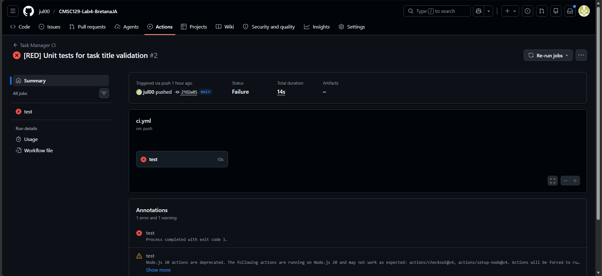
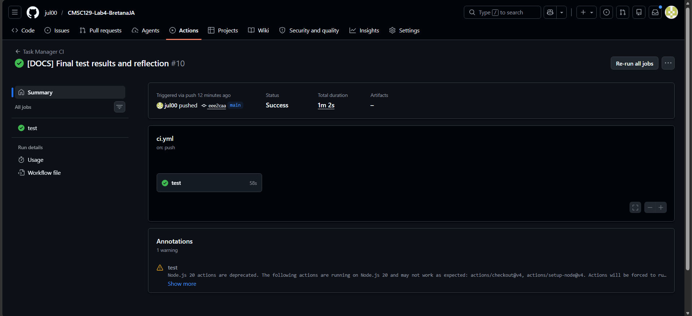
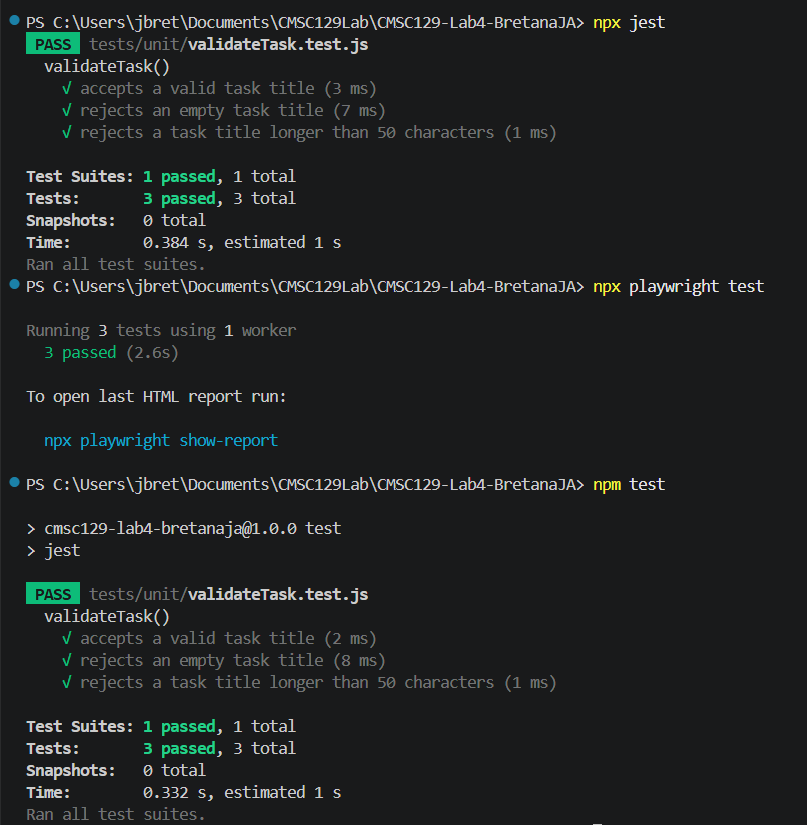

# Task Manager App
A very simple task manager app.

## Live Deployment URL:
[https://taskmanager-bretanaja.onrender.com](https://taskmanager-bretanaja.onrender.com) 


## User Stories
- As a user, I want to create a task so that I can keep track of things I need to do.

- As a user, I want to mark a task as completed so that I can see which tasks are finished.

- As a user, I want to delete a task so that I can remove tasks I no longer need.

## Tech Stack
Frontend: React + Vite

Backend: Express

Unit tests: Jest

Integration tests: Jest + Supertest

System tests: Playwright

## Testing Strategy

This project follows the Test-Driven Development (TDD) approach using the Red → Green → Refactor cycle at three testing levels: unit, integration, and system testing. Each level focuses on a different responsibility of the application to ensure both correctness and reliability.

### Unit Testing

Unit tests focus on isolated business logic without involving HTTP requests, the browser, or the backend server. The unit tests will target the task title validation logic to ensure task input behaves correctly before tasks are created.

The following behaviors will be tested:

- Valid task titles are accepted
- Empty task titles are rejected
- Task titles longer than 50 characters are rejected

These tests ensure the validation logic works independently and catches incorrect input early.

Tools used: Jest

### Integration Testing

Integration tests verify that the backend API routes, request handling, and task data storage work together correctly through real HTTP requests. These tests ensure that the Express routes correctly interact with the task management logic and return the proper responses.

The following behaviors will be tested:

- ``` POST /tasks ``` successfully creates a task and returns the correct response
- ``` DELETE /tasks/:id ``` successfully removes an existing task

These tests confirm that the backend components function correctly as a connected system.

**Tools used**: Jest + Supertest

### System Testing

System tests simulate real user interactions in a browser using Playwright. These tests verify complete user stories from the frontend UI through the backend API.

The following user journeys will be tested:

- A user can create a task and see it displayed
- A user can mark a task as completed
- A user can delete a task from the list

These tests ensure the entire application works correctly from the user’s perspective.

**Tools used**: Playwright

## Setup Instructions
### Prerequisites
Make sure you have [Node.js](https://nodejs.org/) installed on your machine (v18 or higher recommended).

---

### 1. Clone the Repository
Open your terminal, navigate to your desired working directory, and run:
```bash
git clone https://github.com/jul00/CMSC129-Lab4-BretanaJA.git
cd CMSC129-Lab4-BretanaJA
```
### 2. Install Dependencies
```bash 
npm install
```
After dependencies finish installing, ensure the Playwright automated browser binaries are initialized on your machine:
```bash
npx playwright install --with-deps
```
### 3. Running Test Suites
The project leverages a strict multi-tiered testing strategy. You can run individual layers or invoke them via the global testing runners.
- **Run Backend**
```bash
npx jest
```
- **Run End-to-End System Tests (Playwright - Headless Mode):**
```bash
npx playwright test
```
- **Run End-to-End System Tests with UI Watch Mode:**
```bash
npx playwright test --ui
```

### 4. Running the Web Application Locally
To boot up the production workspace environment and interact with the Task Manager application interface manually:

1. Start the Express backend server:
```bash
node backend/server.js
```

2. Open your web browser and navigate to:
``` plaintext
http://localhost:3000
```

3. To stop the local runtime process, press Ctrl + C in your terminal window.

# CI/CD Setup

This project implements a fully automated DevOps workflow using **GitHub Actions** for Continuous Integration (CI) and **Render** for Continuous Deployment (CD).

### Pipeline Configuration & Mechanics
* **CI Tool:** GitHub Actions (configured via `.github/workflows/ci.yml`)
* **Workflow Triggers:** * Automatically executes on every `push` to the `main`/`master` branches.
  * Automatically executes on every `pull_request` targeted at `main`/`master`.
* **Deployment Gate:** Production deployment only proceeds if the Unit tests, Integration tests (Jest), and End-to-End System tests (Playwright) clear successfully.

### Automated TDD Evidence
### 1. ❌ Failure Phase


### 2. ✅ Success Phase


# Test Results
## Unit Test Results 


## Final Test Results & Verification


# Reflection
After spending so long writing programs, seeing if it somehow works, then committing and pushing it then seeing something doesn't work/is incomplete then making a fix, seeing if it somehow works, then committing and pushing it then seeing something doesn't work/is incomplete, then making a fi(you get it, sir), making tests before code was a bit of an uncomfortable thing for me to do. It's not something I've done before and after going about writing programs the way I have for quite some time, it feels so weird to go against my usual workflow. 

The most difficult part about writing tests before code, aside from actually coding it since I'm very unfamiliar with it, was slowing down to think about what needs to be achieved instead of just rushing in and creating something then seeing what's going right or wrong. 

Writing tests first did make me change the way I designed my code. It made me feel more deliberate when I was creating the application. Instead of having a mental checklist of what I need to implement and how I should implement it and forgetting some of it, I knew the steps I needed to take beforehand. It made me think more about if what I had made actually works as intended or if it works just for the moment.